Gather is an application that allows users to: 

- Add events of waste audit.
- Input the data of different kinds of trash audited.
- View data of all the audit events.

# Overview

The Department of Sustainability, or DoS, has a great process for identifying and tracking suspected contributors in waste management practices. Through waste audits, community members can contribute to the cause and provide valuable data that can be analyzed to draw important conclusions and provide a basis to incite change at the legislative level. However, once the waste audit is done, the data must be input manually by DoS personnel. In addition, the database access and storage is limited to the local level and not organized in an easily manipulable structure. This makes it difficult to visualize data to emphasize important issues and conclusions because it must be done manually through much analysis.

Our solution is a two-pronged approach involving a web app and a smart bin. Our web app “Gather” features a robust, easily-accessible database in the cloud, a submission form providing a streamlined, delegated approach to data entry, and a compelling selection of visualizations that accurately convey the implications in the data—all wrapped in a clean, simple, and intuitive user interface. Our smart bin leverages the cloud database, introducing a continuous stream of data that facilitates an increase of sample size in orders of magnitude at a much smaller cost.

In order to realize our solution, we are implementing a database in a series of collections through MongoDB. The web app will use the JavaScript framework Meteor with Semantic UI React, simplifying the process of designing and deploying a clean, intuitive app. The accompanying smart bin will be implemented using proximity and load cell sensors connected to a NodeMCU WiFi Development Board that’s programmed to push data to our database using the MQTT protocol.

[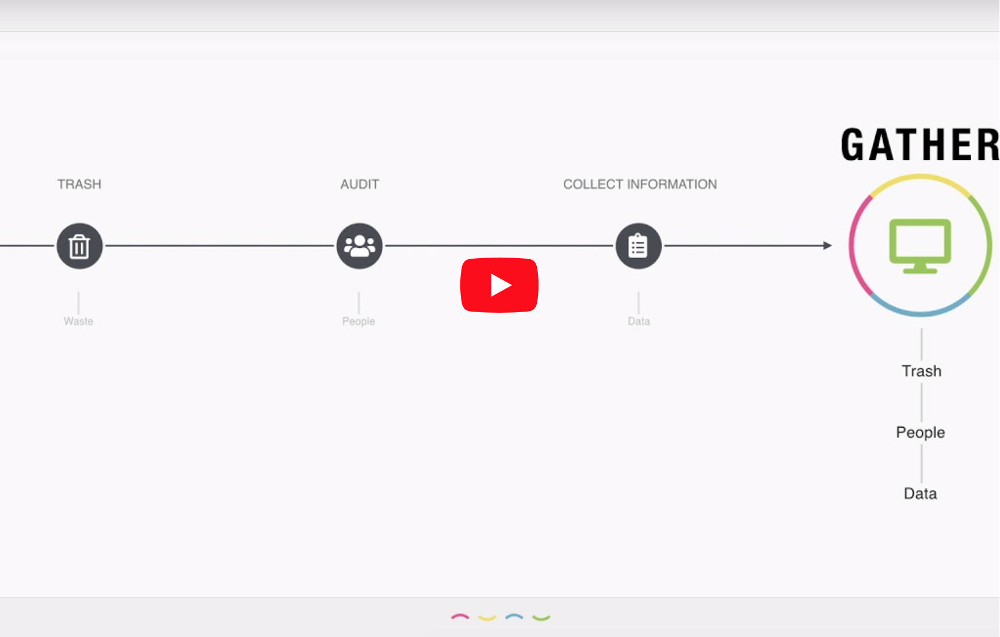](https://www.youtube.com/watch?v=XZxnj_RrCKs)

# Developement Progress 
- [Gather Web App](http://gather.meteorapp.com/#/)
- [Devpost Video](https://devpost.com/software/johnson-family-waste-audit-app)
- [Milestone 1](https://github.com/HACC2018/The-Johnson-Family/projects/2) 
- [Milestone 2](https://github.com/HACC2018/The-Johnson-Family/projects/3) 
- [Milestone 3](https://github.com/HACC2018/The-Johnson-Family/projects/4) 

# User Guide
 
When you first visit the page, you will be greeted by our Landing Page!
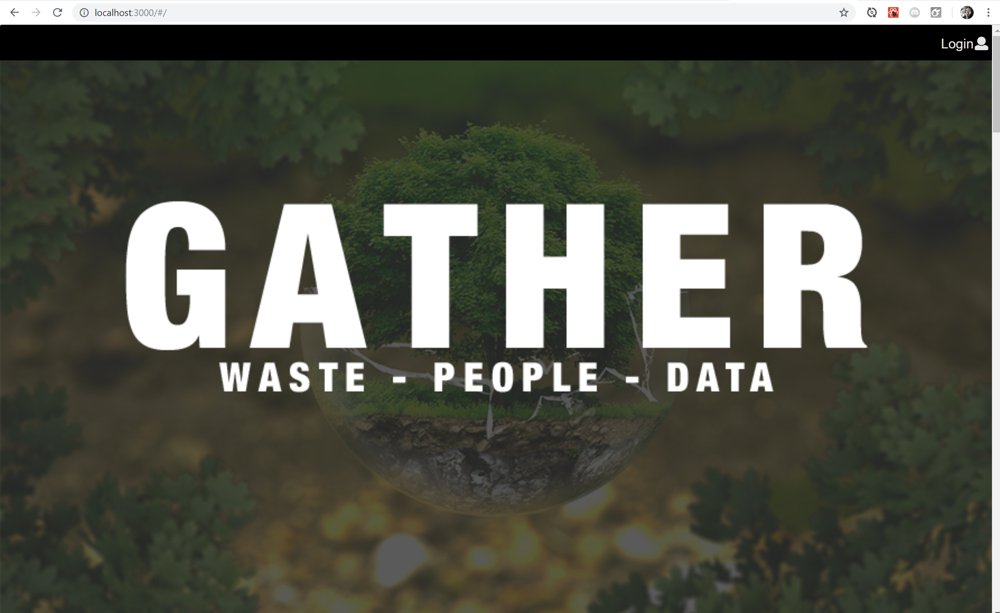
 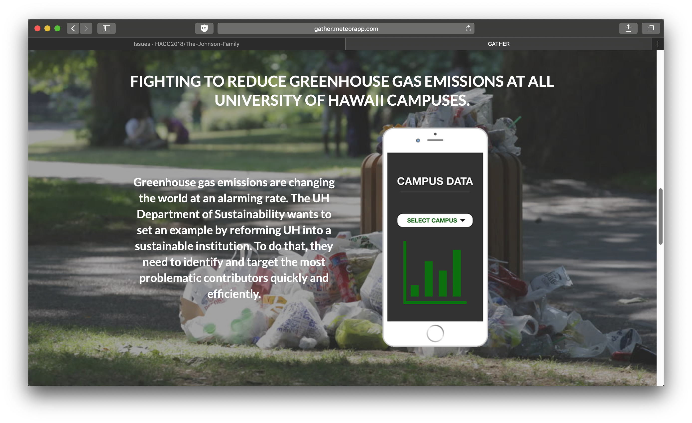
 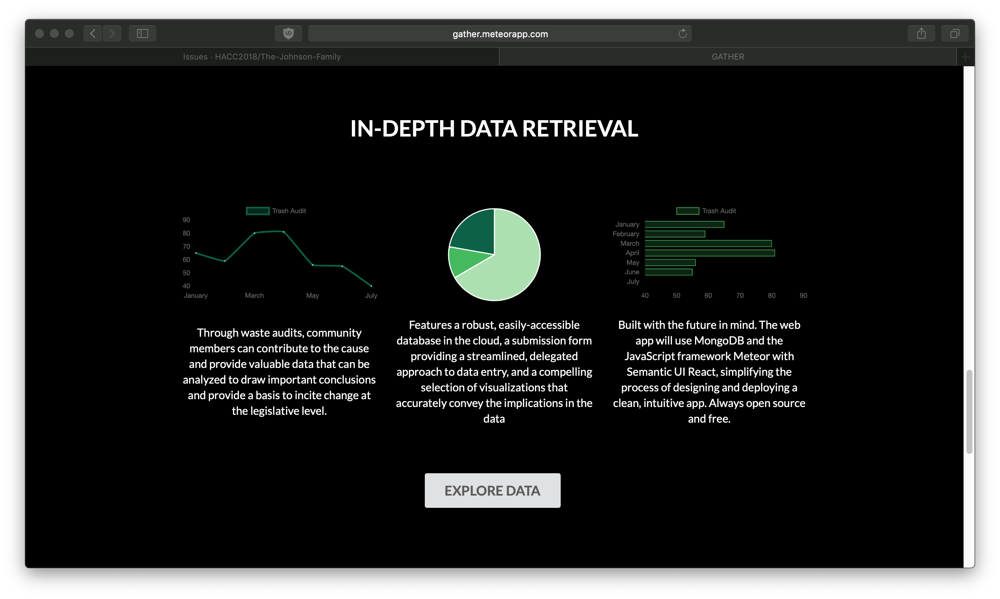
 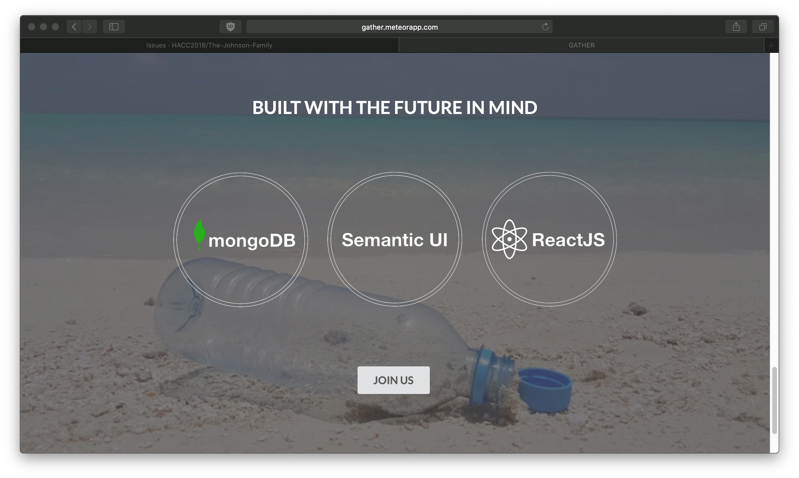

Anyone can create an account.

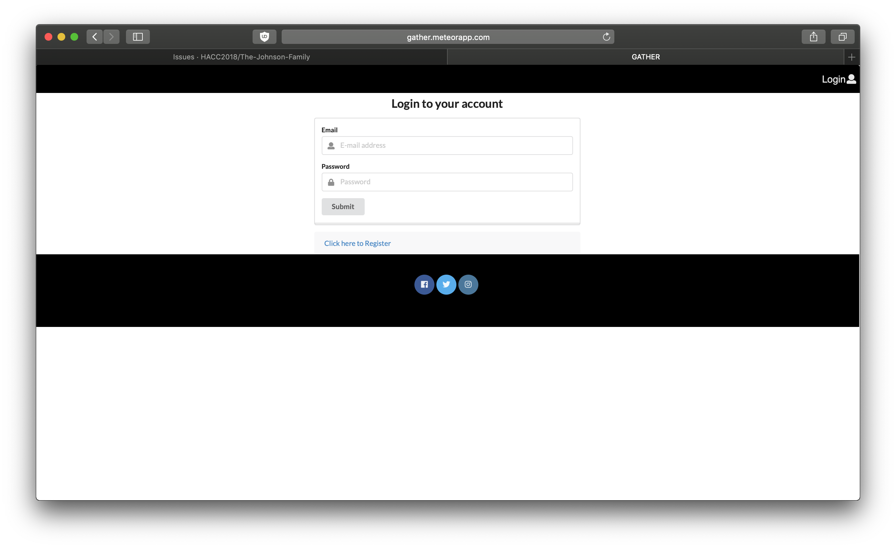

Once you are signed in, you can visit the Dashboard page, which gives you an indepth look into current trash audit statistics.

 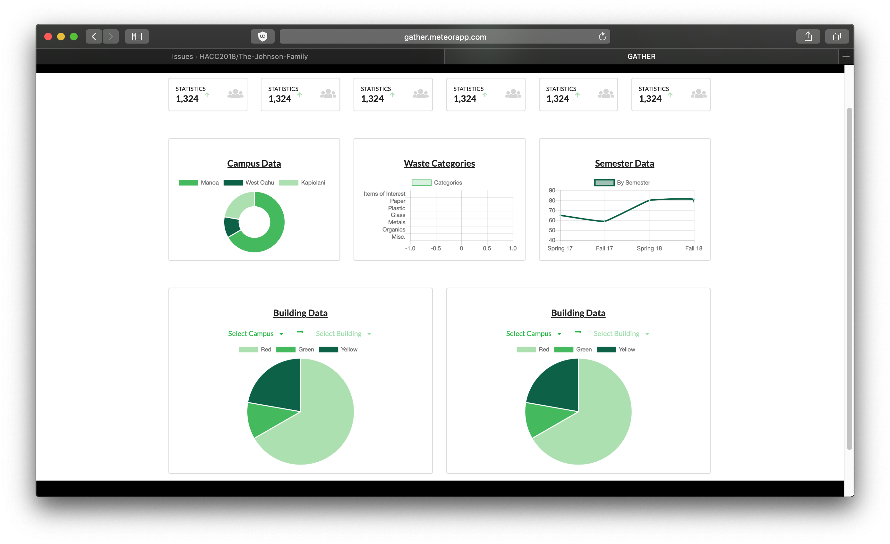

You can also add your trash audit information for the Department of Sustainability at UH Manoa to verify and add to the data chart.

 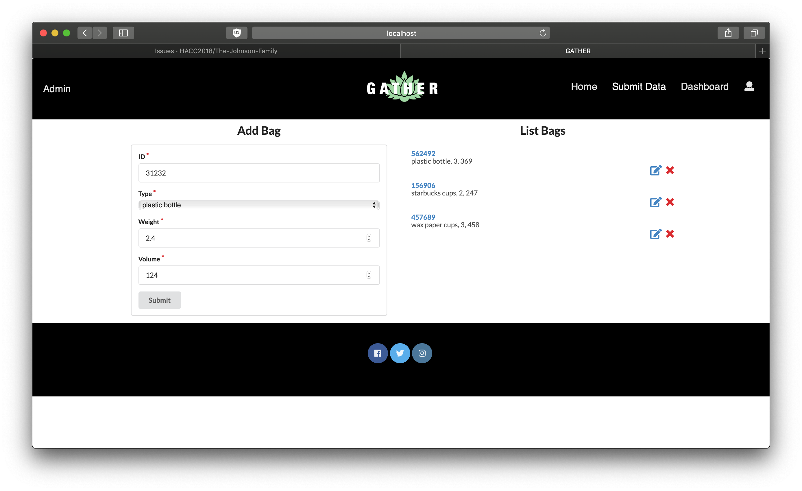

As an administrator, you can then view pending data and confirm the information to add to the dashboard.

 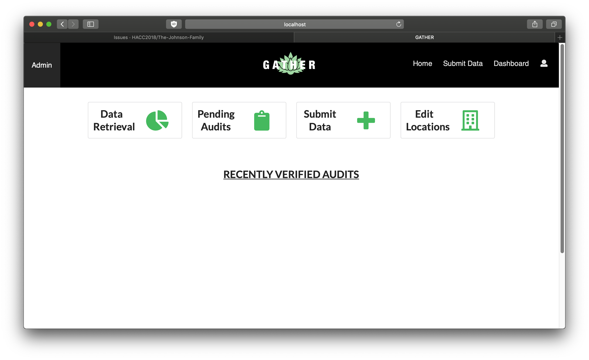

# Installation

First, install Meteor.
 
 Second, download a copy of Gather, or clone it using git.
 
 Third, cd into the app directory install the required libraries with:
 
 
 
 Once the libraries are installed, you can run the application by invoking:
  
  
  
 If all goes well, the application will appear at http://localhost:3000. 

 
# Application Design
## Directory structure
 
 The top-level directory structure contains:
 
 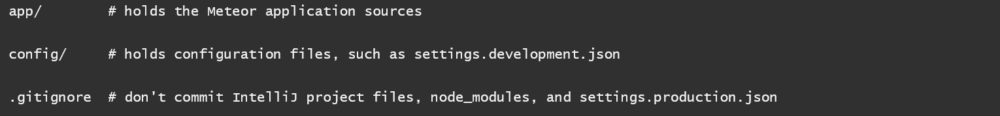
 
 This structure separates configuration files (such as the settings files) in the config/ directory from the actual Meteor application in the app/ directory.
 
 The app/ directory has this top-level structure:
 
 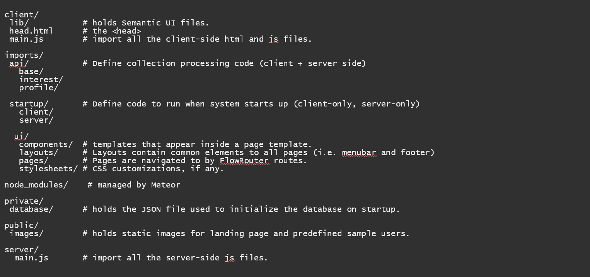
 
## Import conventions
 
 This system adheres to the Meteor 1.4 guideline of putting all application code in the imports/ directory, and using client/main.js and server/main.js to import the code appropriate for the client and server in an appropriate order.
 
 This system accomplishes client and server-side importing in a different manner than most Meteor sample applications. In this system, every imports/ subdirectory containing any Javascript or HTML files has a top-level index.js file that is responsible for importing all files in its associated directory.
 
 Then, client/main.js and server/main.js are responsible for importing all the directories containing code they need. For example, here is the contents of client/main.js:
 
 
 
 Apart from the last line that imports style.css directly, the other lines all invoke the index.js file in the specified directory.
 
 We use this approach to make it more simple to understand what code is loaded and in what order, and to simplify debugging when some code or templates do not appear to be loaded. In our approach, there are only two places to look for top-level imports: the main.js files in client/ and server/, and the index.js files in import subdirectories.
 
 Note that this two-level import structure ensures that all code and templates are loaded, but does not ensure that the symbols needed in a given file are accessible. So, for example, a symbol bound to a collection still needs to be imported into any file that references it.
 
 Apart from the last line that imports style.css directly, the other lines all invoke the index.js file in the specified directory.
 
 We use this approach to make it more simple to understand what code is loaded and in what order, and to simplify debugging when some code or templates do not appear to be loaded. In our approach, there are only two places to look for top-level imports: the main.js files in client/ and server/, and the index.js files in import subdirectories.
 
 Note that this two-level import structure ensures that all code and templates are loaded, but does not ensure that the symbols needed in a given file are accessible. So, for example, a symbol bound to a collection still needs to be imported into any file that references it.
 
## Naming Convention
 
 This system adopts the following naming conventions:
 
 - Files and directories
 are named in all lowercase, with words separated by hyphens. Example: accounts-config.js
 - “Global” Javascript variables (such as collections) are capitalized. Example: Profiles.
 - Other Javascript variables are camel-case. Example: collectionList.
 - Templates representing pages are capitalized, with words separated by underscores. Example: Directory_Page. The files for this template are lower case, with hyphens rather than underscore. Example: directory-page.html, directory-page.js.
 - Routes to pages are named the same as their corresponding page. Example: Directory_Page.
  
## Data model
 
 Updating soon...
 
## CSS
 
 The application uses the Semantic UI CSS framework. To learn more about the Semantic UI theme integration with Meteor, see Semantic-UI-Meteor.
 
 The Semantic UI theme files are located in app/client/lib/semantic-ui directory. Because they are located in the client/ directory and not the imports/ directory, they do not need to be explicitly imported to be loaded. (Meteor automatically loads all files into the client that are located in the client/ directory).
 
 Note that the user pages contain a menu fixed to the top of the page, and thus the body element needs to have padding attached to it. However, the landing page does not have a menu, and thus no padding should be attached to the body element on that page. To accomplish this, the router uses “triggers” to add an remove the appropriate classes from the body element when a page is visited and then left by the user.
 
## Routing
  
  Updating soon...
  
## Authentication
  
 Only the admin can login and access the data. Admin can be identify as the person who is in charge of the waste audit event at the time.
  
## Authorization
  
 The landing page is public and can be access by anyone with the link.
 
## Configuration
  
  The config directory is intended to hold settings files. The repository contains one file: config/settings.development.json.
  
  The .gitignore file prevents a file named settings.production.json from being committed to the repository. So, if you are deploying the application, you can put settings in a file named settings.production.json and it will not be committed.
 
# Quality Assurance
## ESLint
 
 Gather includes a .eslintrc file to define the coding style adhered to in this application. You can invoke ESLint from the command line as follows:
 
 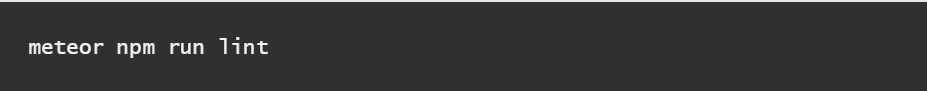
 
 ESLint should run without generating any errors.
 
 It’s significantly easier to do development with ESLint integrated directly into your IDE (such as IntelliJ).
 
# Development History
 
 The development process for Gather conformed to Issue Driven Project Management practices. In a nutshell, development consists of a sequence of Milestones. Milestones consist of issues corresponding to 2-3 day tasks. GitHub projects are used to manage the processing of tasks during a milestone.
 
 The following sections document the development history of Gather.
