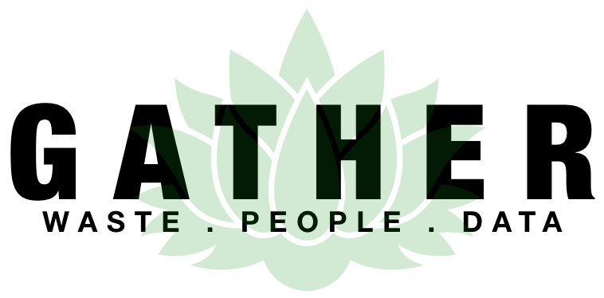
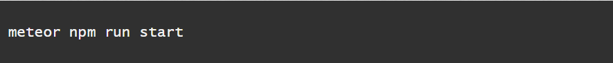

Gather is an application that allows users to: 

- Add events of waste audit.
- Input the data of different kinds of trash audited.
- View data of all the audit events.

# Overview

The Department of Sustainability, or DoS, has a great process for identifying and tracking suspected contributors in waste management practices. Through waste audits, community members can contribute to the cause and provide valuable data that can be analyzed to draw important conclusions and provide a basis to incite change at the legislative level. However, once the waste audit is done, the data must be input manually by DoS personnel. In addition, the database access and storage is limited to the local level and not organized in an easily manipulable structure. This makes it difficult to visualize data to emphasize important issues and conclusions because it must be done manually through much analysis.

Our solution is a two-pronged approach involving a web app and a smart bin. Our web app “Gather” features a robust, easily-accessible database in the cloud, a submission form providing a streamlined, delegated approach to data entry, and a compelling selection of visualizations that accurately convey the implications in the data—all wrapped in a clean, simple, and intuitive user interface. Our smart bin leverages the cloud database, introducing a continuous stream of data that facilitates an increase of sample size in orders of magnitude at a much smaller cost.

In order to realize our solution, we are implementing a database in a series of collections through MongoDB. The web app will use the JavaScript framework Meteor with Semantic UI React, simplifying the process of designing and deploying a clean, intuitive app. The accompanying smart bin will be implemented using proximity and load cell sensors connected to a NodeMCU WiFi Development Board that’s programmed to push data to our database using the MQTT protocol.

# Developement Progress 
- [Gather Web App](http://gather.meteorapp.com/#/)
- [Devpost Video](https://devpost.com/software/johnson-family-waste-audit-app)
- [Milestone 1](https://github.com/HACC2018/The-Johnson-Family/projects/2) 
- [Milestone 2](https://github.com/HACC2018/The-Johnson-Family/projects/3) 
- [Milestone 3](https://github.com/HACC2018/The-Johnson-Family/projects/4) 

# User Guide
 
When you first visit the page, you will be greeted by our Landing Page!

 
 
 

Anyone can create an account.

Once you are signed in, you can visit the Dashboard page, which gives you an indepth look into current trash audit statistics.

 

You can also add your trash audit information for the Department of Sustainability at UH Manoa to verify and add to the data chart.

 

As an administrator, you can then view pending data and confirm the information to add to the dashboard.

 

# Installation

First, install Meteor.
 
 Second, download a copy of Gather, or clone it using git.
 
 Third, cd into the app directory install the required libraries with:
 
 
 
 Once the libraries are installed, you can run the application by invoking:
  
  
  
 If all goes well, the application will appear at http://localhost:3000. 

# Community Feedback
 
 "The landing page looks nice and modern. Gives me a good summary of what the app does."
 
 "This is SO COOL. The graphs are REALLY nice!"
 
 "The website looks pretty but the button on home page doesn’t work. The graphs looks cool. It’s really professional."
 
 "I enjoy the organized and delegated approach to data entry and the selection of various visualizations that accurately convey the implications in the data. It’s clean, simple, and intuitive."
 
 "The beauty of this app is that I can use it on the go! Whether it be at the airport, Starbucks, or even my daughter’s birthday party, GATHER is always there when I need it."
 
 "I would I could replace my husband with GATHER. It never lets me down."
 
 The general concensus was that the app had a very nice aesthetic, and everybody found the dashboard page fascinating. They said it seemed like it would really be a helpful app once it became fully-featured.
